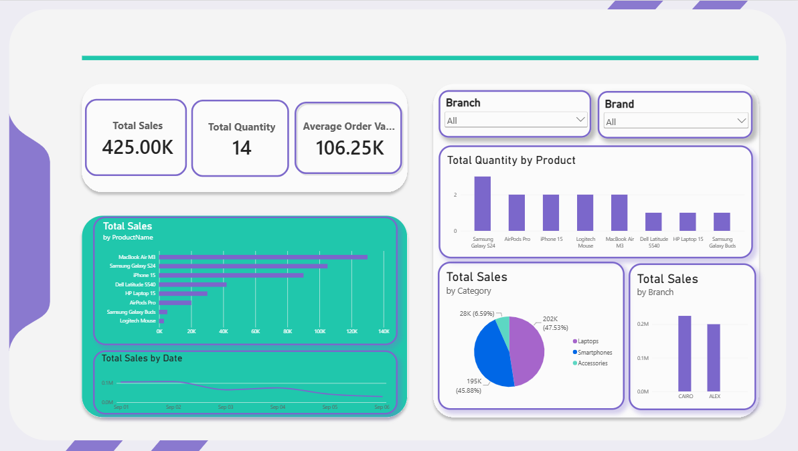
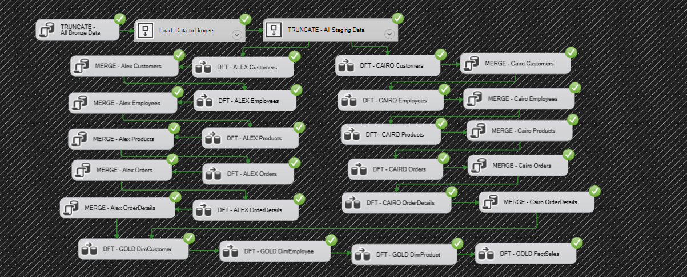

# TechMart — SQL Server Data Warehouse & SSIS ETL

An end-to-end **Data Warehousing and ETL project** built using **Microsoft SQL Server, SSIS, T-SQL, and Power BI**.

The project integrates data from two branch databases — **Cairo** and **Alexandria** — into a centralized data warehouse using a **Medallion Architecture** with Bronze, Staging, Silver, and Gold layers.

The final Gold layer is connected to Power BI to provide business-focused reporting and analysis.

---

## 📌 Project Overview

The main goal of the project is to build a complete data pipeline that:

- Extracts data from multiple source databases
- Loads raw data into the Bronze layer
- Uses a Staging layer for intermediate processing
- Cleans and integrates data into the Silver layer
- Builds a business-ready Gold analytical model
- Implements incremental loading using `MERGE`
- Automates ETL execution using SSIS and SQL Server Agent
- Provides analytical reporting through Power BI

### Source Systems

The project uses two source databases:

- **TechMart_Cairo**
- **TechMart_Alex**

Each source contains:

- Customers
- Employees
- Products
- Orders
- OrderDetails

---

## 🏗️ Architecture

```text
                    SOURCE SYSTEMS
              ┌───────────────────────┐
              │   Cairo Database      │
              │   Alexandria Database │
              └───────────┬───────────┘
                          │
                          ▼
                    🥉 BRONZE
                 Raw Source Data
                          │
                          ▼
                    STAGING
             Clean / Validate / Prepare
                          │
                          ▼
                    🥈 SILVER
             Integrated & Transformed
                          │
                          ▼
                     🥇 GOLD
             Business-Ready Data Model
                          │
                          ▼
                     POWER BI
               Reporting & Analysis
```

---

## 🥉 Bronze Layer

The Bronze layer stores raw data extracted from the source databases.

The source data is loaded into separate Bronze tables for the Cairo and Alexandria branches.

Example tables include:

- Customers
- Employees
- Products
- Orders
- OrderDetails

The Bronze layer preserves the source data before further transformation.

---

## 🔄 Staging Layer

The Staging layer is used as an intermediate processing area between Bronze and Silver.

It provides a place to:

- Prepare incoming data
- Validate records
- Apply required transformations
- Prepare data for integration into the Silver layer

---

## 🥈 Silver Layer

The Silver layer contains cleaned and integrated data from the different source branches.

Data from Cairo and Alexandria is processed into a centralized structure suitable for downstream analytical processing.

The project uses **T-SQL stored procedures with `MERGE` statements** to handle new and updated records.

### Incremental Loading

Instead of processing all records every time, the ETL process identifies new and changed records using ingestion/update timestamps.

The `MERGE` procedures then:

- Insert new records
- Update existing records when changes are detected

This allows the pipeline to process incremental changes rather than reloading the entire dataset unnecessarily.

---

## 🥇 Gold Layer

The Gold layer contains the analytical data model used for reporting.

The model is organized around a central sales fact table and supporting dimensions.

### Main Components

**FactSales**

Contains measures and transactional information such as:

- Sales Amount
- Quantity
- Order ID

**Dimensions**

- DimCustomer
- DimProduct
- DimBranch
- DimDate
- DimEmployee

This structure provides a business-friendly model for analytical queries and Power BI reporting.

---

## 🔁 ETL Process

The overall data flow is:

```text
Cairo + Alexandria
        │
        ▼
     Bronze
        │
        ▼
    Staging
        │
        ▼
     Silver
        │
        ▼
      Gold
        │
        ▼
    Power BI
```

The ETL process is implemented using **SQL Server Integration Services (SSIS)**.

The SSIS package handles the movement and processing of data across the warehouse layers.

---

## ⚙️ Incremental Loading & Stored Procedures

The project includes stored procedures for handling data integration.

### MERGE Procedures

Separate procedures are provided for the Cairo and Alexandria source entities.

They handle:

- Customers
- Employees
- Products
- Orders
- OrderDetails

The `MERGE` logic supports incremental loading by identifying new and updated records.

### Truncate Procedure

A dedicated `truncate_proc` procedure is included to clear the required warehouse tables when a full reload or reset is needed.

---

## ⏱️ Automation

The SSIS package was deployed to SQL Server and scheduled using **SQL Server Agent**.

This allows the ETL pipeline to run automatically according to a defined schedule instead of requiring manual execution.

---

## 📊 Power BI Dashboard

The Gold layer is connected to **Power BI** for reporting and visualization.

The dashboard includes metrics such as:

- **Total Sales:** 425,000
- **Total Quantity:** 14
- **Average Order Value:** 106,000

It also provides:

- Sales by Branch
- Monthly Sales Trend
- Product Analysis
- Category Analysis
- Branch filtering

### Dashboard Preview



---

## 🖥️ SSIS Control Flow

The project includes an SSIS control-flow design for orchestrating the ETL process.



---

## 🛠️ Technologies Used

### Database & ETL
- Microsoft SQL Server
- T-SQL
- SQL Server Integration Services (SSIS)
- SQL Server Agent

### Data Engineering
- ETL
- Data Warehousing
- Medallion Architecture
- Incremental Loading
- `MERGE`
- Stored Procedures
- Dimensional Modeling

### Analytics
- Power BI

### Development
- Visual Studio
- Git
- GitHub

---

## 📁 Repository Structure

```text
TechMart-SQL-Server-Data-Warehouse-SSIS-ETL/
│
├── sql/
│   ├── 01_create_databases.sql
│   ├── 02_create_datawarehouse_and_medallion_schemas.sql
│   ├── 03_create_bronze_tables.sql
│   ├── 04_create_staging_tables.sql
│   ├── 05_create_silver_tables.sql
│   ├── 06_create_gold_tables.sql
│   │
│   └── stored_procedures/
│       ├── truncate_Procedure.sql
│       │
│       └── merge/
│           ├── merge_ALEX_Customers.sql
│           ├── merge_ALEX_Employees.sql
│           ├── merge_ALEX_OrderDetails.sql
│           ├── merge_ALEX_Orders.sql
│           ├── merge_ALEX_Products.sql
│           ├── merge_CAIRO_Customers.sql
│           ├── merge_CAIRO_Employees.sql
│           ├── merge_CAIRO_OrderDetails.sql
│           ├── merge_CAIRO_Orders.sql
│           └── merge_CAIRO_Products.sql
│
├── ssis/
│   ├── Integration Services Project2.slnx
│   │
│   └── Integration Services Project2/
│       ├── Integration Services Project2.database
│       ├── Integration Services Project2.dtproj
│       ├── Project.params
│       └── TechMart.dtsx
│
├── powerbi/
│   └── TechMart_Dashboard.pbix
│
├── docs/
│   ├── powerbi_dashboard.png
│   └── ssis_control_flow.png
│
├── .gitignore
└── README.md
```

---

## 🚀 How the Project Works

### 1. Create Source Databases

Run:

```text
sql/01_create_databases.sql
```

This creates the Cairo and Alexandria source databases and their tables.

### 2. Create the Data Warehouse

Run:

```text
sql/02_create_datawarehouse_and_medallion_schemas.sql
```

This creates the warehouse and Medallion Architecture schemas.

### 3. Create Warehouse Tables

Run the scripts in order:

```text
03_create_bronze_tables.sql
04_create_staging_tables.sql
05_create_silver_tables.sql
06_create_gold_tables.sql
```

### 4. Create Stored Procedures

Create the required procedures from:

```text
sql/stored_procedures/
```

The `merge/` folder contains the source-specific MERGE procedures used for incremental loading.

### 5. Execute the SSIS Package

Open the SSIS project in Visual Studio and execute the package to run the ETL pipeline.

### 6. Automate Execution

Deploy the SSIS package to SQL Server and configure a SQL Server Agent job to execute it on a schedule.

### 7. Analyze the Data

Connect Power BI to the Gold layer and use the dashboard for reporting and analysis.

---

## 🎯 Key Learning Outcomes

Through this project, I gained practical experience with:

- Designing a SQL Server data warehouse
- Implementing Medallion Architecture
- Building ETL pipelines with SSIS
- Integrating data from multiple source systems
- Implementing incremental loading with `MERGE`
- Working with stored procedures
- Building analytical dimensional models
- Automating ETL pipelines with SQL Server Agent
- Connecting a data warehouse to Power BI
- Translating business requirements into analytical reports

---

## 👩‍💻 Author

**Maryam Galal**

Computer and Information Sciences Graduate  
Ain Shams University

Interested in **Data Engineering, Data Science, and AI**.
